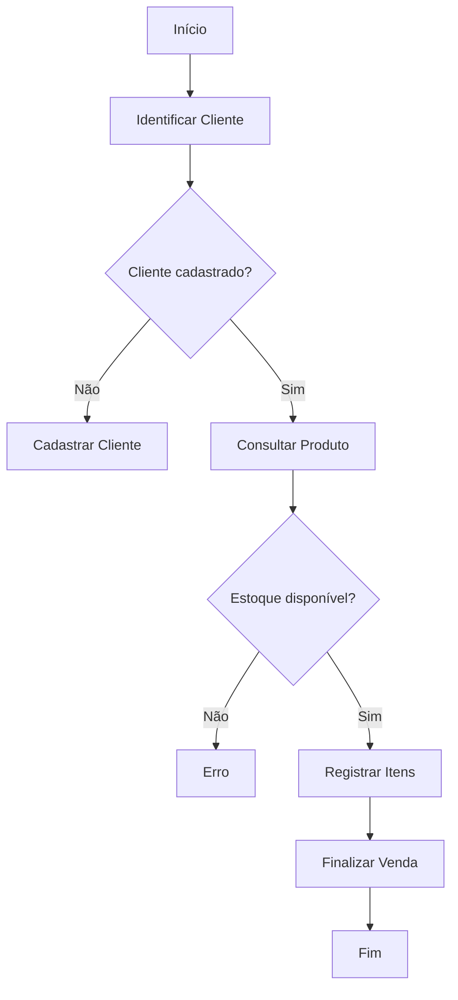
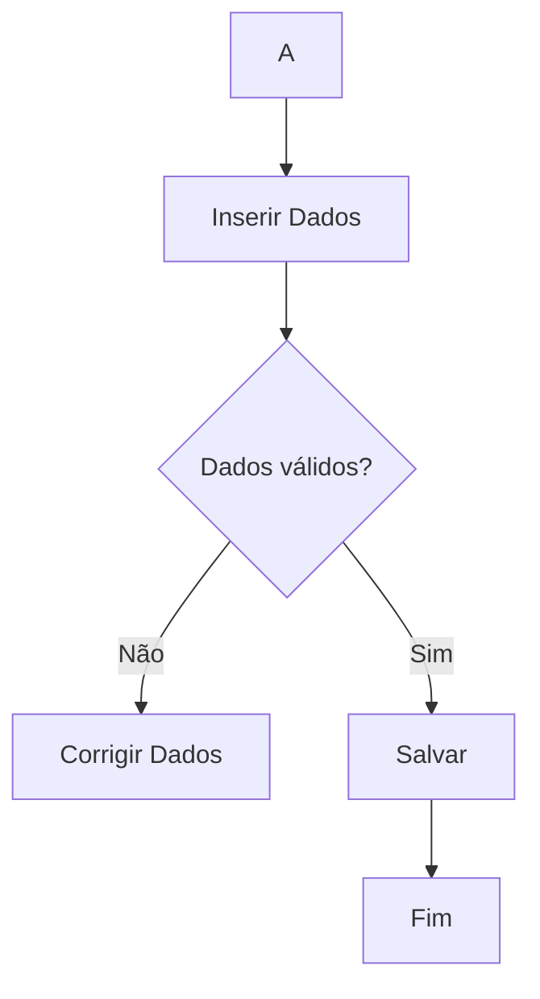
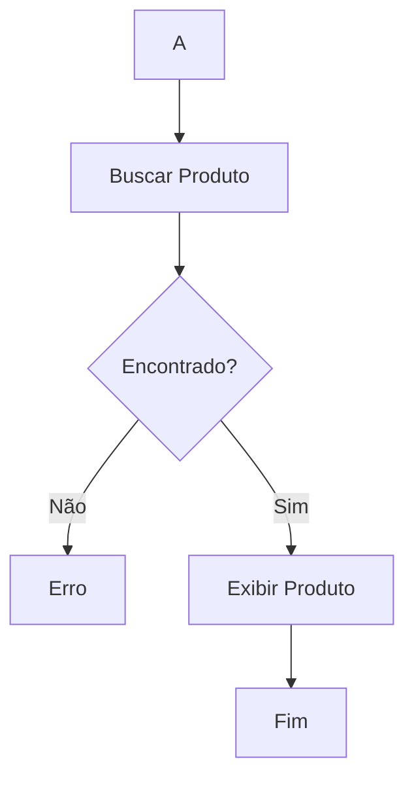
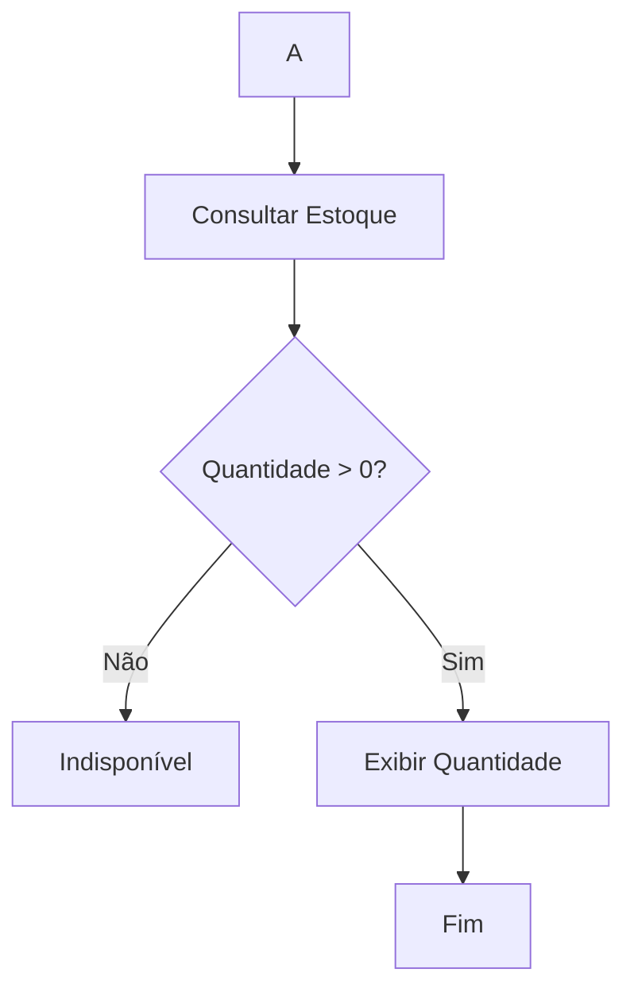
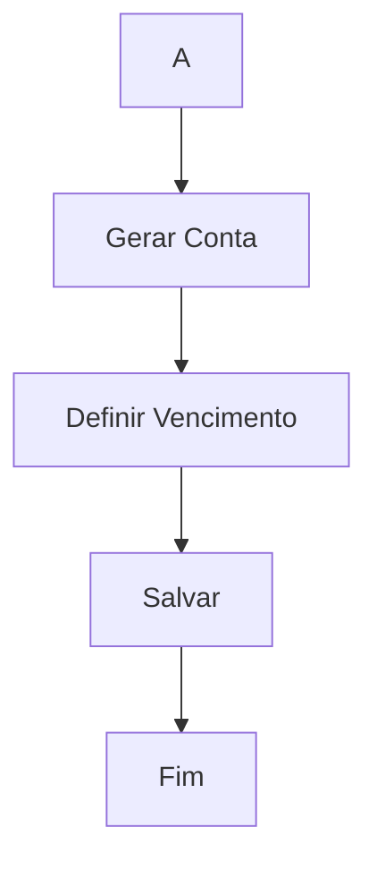
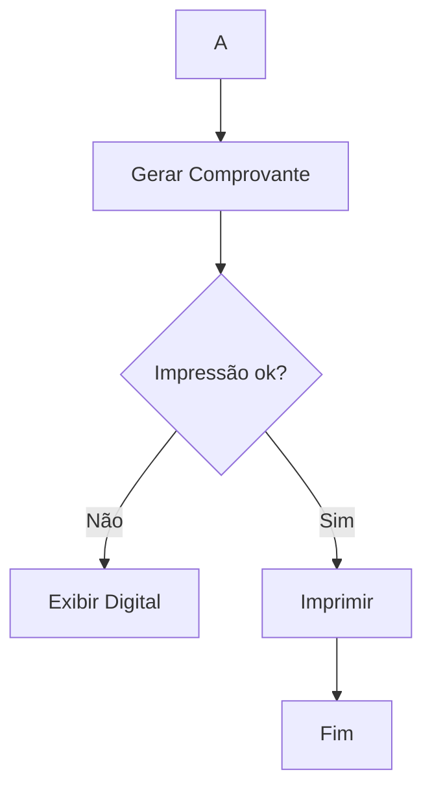
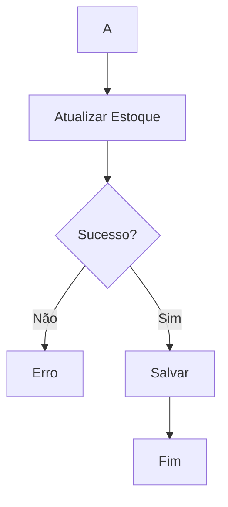
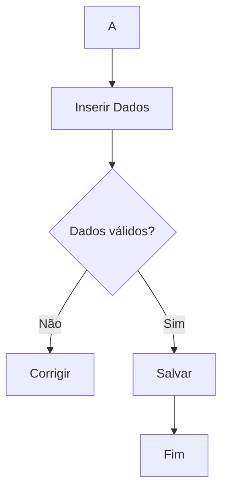
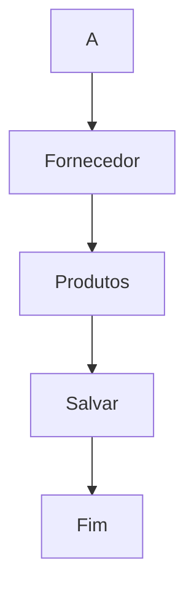
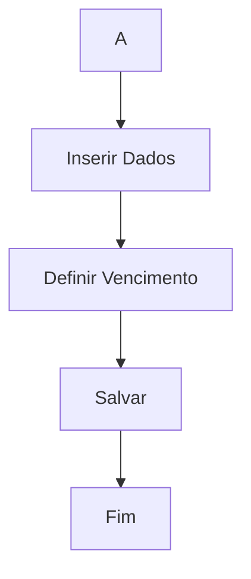

# Avaliação — Engenharia de Software  
## Sistema Integrado de Gestão de Farmácia — MVP Definido pelo Estudante  

**Aluno: Yasmin Silva**   
**RA: 24000753**
**Data:** 26/03/2026  

---
## 1. Definição do MVP  

Meu MVP cobre o processo de venda de produtos em uma unidade da farmácia, incluindo identificação/cadastro do cliente, consulta de produtos, verificação de estoque, registro da venda e emissão de comprovante.  

###  Dentro do MVP:
- Cadastro de cliente  
- Consulta de produtos  
- Verificação de estoque  
- Registro de venda  
- Emissão de comprovante  
- Venda à vista e a prazo  

###  Fora do MVP:
- Relatórios gerenciais  
- Integração entre unidades  
- Compras com fornecedores  
- Controle financeiro completo  

###  Justificativa:
Essas escolhas foram feitas para priorizar o fluxo principal da farmácia (venda), garantindo funcionamento básico antes de expandir para outras áreas.

---

## 2. Regras de Negócio (mínimo: 5)

**RN01 —** Não é permitido vender produtos sem estoque.  
**RN02 —** Vendas a prazo devem gerar automaticamente uma conta a receber.  
**RN03 —** Clientes devem estar cadastrados para compras a prazo.  
**RN04 —** O estoque deve ser atualizado automaticamente após cada movimentação.  
**RN05 —** Produtos devem possuir preço válido para serem vendidos.  
**RN06 —** Produtos abaixo do estoque mínimo devem gerar alerta ao gerente.  
**RN07 —** Medicamentos controlados exigem validação do farmacêutico.  
**RN08 —** Cada unidade da farmácia possui controle de estoque independente.

---

## 3. Requisitos Funcionais (mínimo: 8)

**RF01 —** O sistema deve permitir cadastrar clientes.  
**RF02 —** O sistema deve permitir consultar produtos.  
**RF03 —** O sistema deve verificar disponibilidade em estoque.  
**RF04 —** O sistema deve registrar vendas.  
**RF05 —** O sistema deve emitir comprovante de venda.  
**RF06 —** O sistema deve permitir vendas a prazo.  
**RF07 —** O sistema deve atualizar estoque automaticamente.  
**RF08 —** O sistema deve registrar contas a receber.  

---
##  4. Requisitos Não Funcionais (mínimo: 4)
**RNF01 —** O sistema deve responder consultas em até 2 segundos.  
**RNF02 —** O sistema deve garantir segurança dos dados dos clientes.  
**RNF03 —** O sistema deve estar disponível 99% do tempo.  
**RNF04 —** O sistema deve possuir controle de acesso por usuário.  
---
## 5. Casos de Uso (mínimo: 10)


- os 10 casos
- relação entre eles e atores
- pelo menos 3 includes
- pelo menos 3 extends

----

## 6. Documentação dos Casos de Uso

---

### UC01 — Realizar Venda

**Ator(es):** Atendente
**Descrição:** Permite registrar uma venda de produtos.

**Pré-condições:**

* Sistema ativo
* Produtos cadastrados

**Pós-condições:**

* Venda registrada
* Estoque atualizado

---

### Fluxo Principal

1. Identificar cliente
2. Consultar produto
3. Verificar estoque
4. Registrar itens
5. Finalizar venda

---

### Fluxos Alternativos / Exceções

**FA01 — Cliente não cadastrado** → Executar UC02
**FA02 — Estoque insuficiente** → Exibir erro e cancelar item

---

### Relacionamentos

**Include:** UC03, UC04, UC06, UC07
**Extend:** UC05

---

### Diagrama de Atividade



---

### UC02 — Cadastrar Cliente

**Ator(es):** Atendente
**Descrição:** Permite cadastrar um cliente.

**Pré-condições:**

* Cliente não cadastrado

**Pós-condições:**

* Cliente registrado

---

### Fluxo Principal

1. Inserir dados
2. Validar dados
3. Salvar

---

### Fluxos Alternativos / Exceções

**FA01 — Dados inválidos** → Solicitar correção

---

### Relacionamentos

**Extend:** UC01

---

### Diagrama de Atividade



---

### UC03 — Consultar Produto

**Ator(es):** Atendente
**Descrição:** Permite buscar produtos no sistema.

**Pré-condições:**

* Produto cadastrado

**Pós-condições:**

* Produto exibido

---

### Fluxo Principal

1. Informar nome/código
2. Exibir produto

---

### Fluxos Alternativos / Exceções

**FA01 — Produto não encontrado** → Exibir mensagem

---

### Relacionamentos

**Include:** UC04

---

### Diagrama de Atividade



---

### UC04 — Verificar Estoque

**Ator(es):** Sistema
**Descrição:** Verifica a disponibilidade de um produto.

**Pré-condições:**

* Produto selecionado

**Pós-condições:**

* Quantidade informada

---

### Fluxo Principal

1. Consultar estoque
2. Exibir quantidade

---

### Fluxos Alternativos / Exceções

**FA01 — Produto sem estoque** → Informar indisponibilidade

---

### Relacionamentos

Include: —
Extend: —

---

### Diagrama de Atividade



---

### UC05 — Registrar Conta a Receber

**Ator(es):** Sistema
**Descrição:** Registra vendas realizadas a prazo.

**Pré-condições:**

* Venda a prazo

**Pós-condições:**

* Conta registrada

---

### Fluxo Principal

1. Gerar conta
2. Definir vencimento
3. Salvar

---

### Fluxos Alternativos / Exceções

**FA01 — Dados inválidos** → Solicitar correção

---

### Relacionamentos

**Extend:** UC01

---

### Diagrama de Atividade



---

### UC06 — Emitir Comprovante

**Ator(es):** Sistema
**Descrição:** Emite comprovante da venda.

**Pré-condições:**

* Venda concluída

**Pós-condições:**

* Comprovante emitido

---

### Fluxo Principal

1. Gerar comprovante
2. Exibir ou imprimir

---

### Fluxos Alternativos / Exceções

**FA01 — Falha na impressão** → Exibir versão digital

---

### Relacionamentos

**Include:** UC01

---

### Diagrama de Atividade



---

### UC07 — Atualizar Estoque

**Ator(es):** Sistema
**Descrição:** Atualiza o estoque após uma venda.

**Pré-condições:**

* Venda realizada

**Pós-condições:**

* Estoque atualizado

---

### Fluxo Principal

1. Subtrair quantidade
2. Salvar

---

### Fluxos Alternativos / Exceções

**FA01 — Erro no sistema** → Cancelar operação

---

### Relacionamentos

**Include:** UC01

---

### Diagrama de Atividade



---

### UC08 — Cadastrar Produto

**Ator(es):** Gerente
**Descrição:** Permite cadastrar novos produtos.

**Pré-condições:**

* Usuário autorizado

**Pós-condições:**

* Produto cadastrado

---

### Fluxo Principal

1. Inserir dados
2. Salvar

---

### Fluxos Alternativos / Exceções

**FA01 — Dados inválidos** → Corrigir

---

### Relacionamentos

Include: —
Extend: —

---

### Diagrama de Atividade



---

### UC09 — Registrar Compra

**Ator(es):** Gerente
**Descrição:** Registra compras de fornecedores.

**Pré-condições:**

* Produto cadastrado

**Pós-condições:**

* Compra registrada

---

### Fluxo Principal

1. Informar fornecedor
2. Informar produtos
3. Salvar compra

---

### Fluxos Alternativos / Exceções

**FA01 — Fornecedor inválido** → Corrigir

---

### Relacionamentos

**Include:** UC07
**Extend:** UC10

---

### Diagrama de Atividade



---

### UC10 — Registrar Conta a Pagar

**Ator(es):** Financeiro
**Descrição:** Registra contas a pagar.

**Pré-condições:**

* Compra realizada

**Pós-condições:**

* Conta registrada

---

### Fluxo Principal

1. Inserir dados
2. Definir vencimento
3. Salvar

---

### Fluxos Alternativos / Exceções

**FA01 — Dados inválidos** → Corrigir

---

### Relacionamentos

**Extend:** UC09

---

### Diagrama de Atividade


### UC11 — Validar Receita

**Ator(es):** Farmacêutico  
**Descrição:** Valida receitas médicas para liberação de medicamentos controlados.

**Pré-condições:**

* Receita apresentada pelo cliente

**Pós-condições:**

* Venda autorizada ou negada

---

### Fluxo Principal

1. Receber receita
2. Analisar dados da receita
3. Validar autenticidade
4. Autorizar venda

---

### Fluxos Alternativos / Exceções

**FA01 — Receita inválida** → Negar venda

---

### Relacionamentos

**Extend:** UC01

---

### Diagrama de Atividade

```mermaid
flowchart TD
A[Início] --> B[Receber Receita]
B --> C{Receita válida?}
C -->|Não| D[Negar Venda]
C -->|Sim| E[Autorizar Venda]
E --> F[Fim]

---
